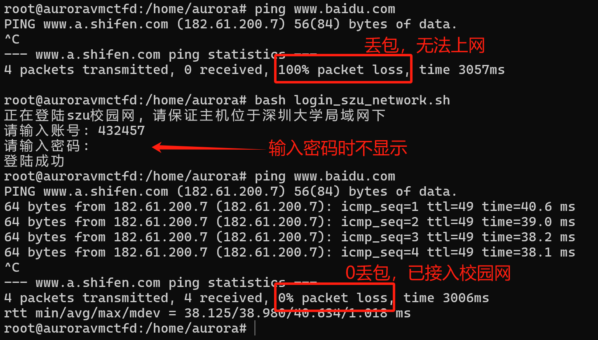

# login_szu_network

一个用于在命令行环境下登陆深大校园网的脚本

效果展示:



# 使用说明

目前该项目仅支持 linux 系统

## 下载项目

```sh
git clone https://github.com/Caterpie771881/login_szu_network.git
```

## 给脚本赋予执行权限

```sh
cd login_szu_network
chmod +x login_szu_network.sh
```

## 使用 bash 执行脚本
```sh
bash login_szu_network.sh
```

# 更加跨平台的选择

什么? 你说你包不用 linux 的?

没关系, 跨平台的 python 版脚本供您选择, 只要您的操作系统支持 python, 都能使用该项目快乐上网

## 配置 python 环境

根据自己的操作系统使用对应的配置方式, 这里不展开

## 下载项目

```sh
git clone https://github.com/Caterpie771881/login_szu_network.git
```

## 执行脚本
```sh
python login_szu_network/login_szu_network.py
```

# 先有鸡还是先有蛋
“想要上网就得先下载这个脚本，但是要下载这个脚本就得先上网”

我知道你很急, 但是你先别急

对于这个哲学问题, 有几个解决办法:

1. 使用U盘等介质将本项目拷贝到机器上
2. 如果你使用 ssh 连接到机器上, 那应该可以 ctrl-C ctrl-V 将文件内容拷贝过去
3. 使用 scp、curl 等远程传输方式将本项目传输到目标主机
4. 手动将精简版脚本 `lite.sh` 写入机器(不推荐, 容易敲错)

以防有人不知道怎么做:
```sh
# 这里假设主机上没有 vi/nano 等文本编辑器
touch lite.sh
echo 'curl -s "https://drcom.szu.edu.cn/" -X POST \'>>lite.sh
echo '-H"User-Agent:Mozilla/5.0"\'>>lite.sh
echo '-H"Content-Type:application/x-www-form-urlencoded" \'>>lite.sh
echo '--data-raw "DDDDD=$1&upass=$2&0MKKey=123456"'>>lite.sh
# 使用方式
chmod +x lite.sh
bash lite.sh 这里填您的账号 这里填您的密码
```
