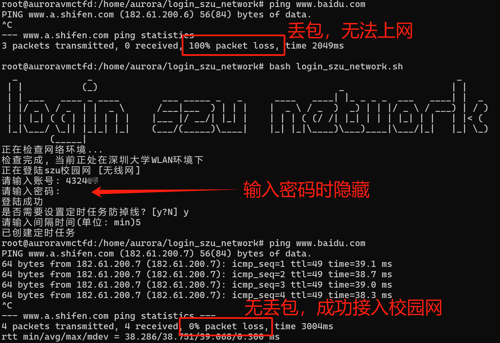

# login_szu_network

一个用于在命令行环境下登陆深大校园网的脚本

效果展示:



# 使用说明

目前该项目仅支持 linux 系统

## 下载项目

```
git clone https://github.com/Caterpie771881/login_szu_network.git
```

## 给脚本赋予执行权限

```
cd login_szu_network
chmod +x login_szu_network.sh
```

## 使用 bash 执行脚本
```
bash login_szu_network.sh
```

# 更加跨平台的选择

什么? 你说你包不用 linux 的?

没关系, 跨平台的 python 版脚本供您选择, 只要您的操作系统支持 python, 都能使用该项目快乐上网

## 配置 python 环境

根据自己的操作系统使用对应的配置方式, 这里不展开

## 下载项目

```
git clone https://github.com/Caterpie771881/login_szu_network.git
```

## 执行脚本
```
python login_szu_network/login_szu_network.py
```
